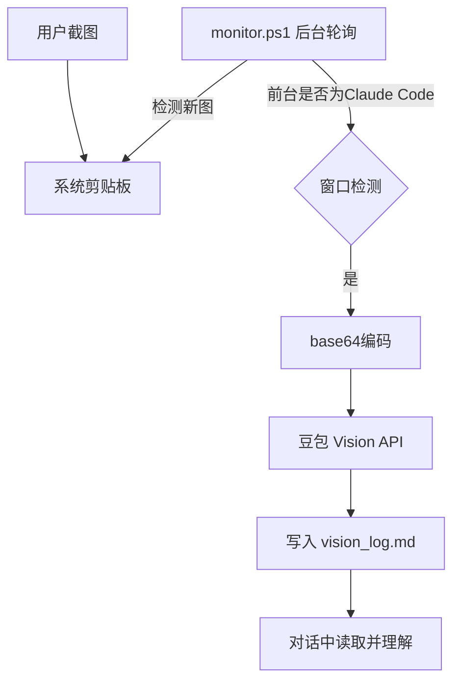

# Clipboard Vision — 设计文档

> 当 Claude Code 接入 DeepSeek V4 Flash（纯文本模型）时，
> 通过豆包/火山引擎 Vision API 为对话补充图片理解能力

## 1. 概述

Claude Code 接入 DeepSeek V4 Flash 后，后端模型是纯文本模型，不具备多模态能力，无法直接「看」图片。本项目通过后台监控剪贴板，自动将新截图发送给豆包 Vision API 识别，结果写入文件供 Claude Code 读取，从而实现「截图 → 识别 → 对话中理解」的完整闭环。

## 2. 设计原则

- **轻量** — 零额外依赖，纯 PowerShell 实现
- **只干一件事** — 监控剪贴板 → 调 API → 写结果，不做多余的
- **可维护** — 模块化项目结构，清晰的接口边界
- **可开源** — 自包含、配置分离、有文档

## 3. 项目结构

```
clipboard-vision/
├── README.md                 # 项目说明、使用方法
├── LICENSE                   # MIT 协议
├── .gitignore
├── config.json               # 配置（API Key、模型名等）
│
├── src/
│   ├── monitor.ps1           # 入口：主循环 + 调度
│   ├── modules/
│   │   ├── clipboard.psm1    # 剪贴板操作（读取、hash 去重）
│   │   ├── window.psm1       # 前台窗口检测
│   │   ├── vision_api.psm1   # 豆包 Vision API 封装
│   │   └── logger.psm1       # 日志输出
│   └── config.ps1            # 读取 config.json
│
├── output/                   # 运行时输出（.gitignore 排除）
│   ├── vision_log.md         # 识别结果（Claude 读取的文件）
│   └── images/               # 保存的剪贴板图片
│
├── install.ps1               # 安装引导
└── start.ps1                 # 启动监控
```

## 4. 模块详细设计

### 4.1 config.json

```json
{
  "api_key": "",
  "model": "<你的豆包视觉模型名>",
  "api_base": "https://ark.cn-beijing.volces.com/api/v3/chat/completions",
  "system_prompt": "你是一个视觉识别模块，请详细描述这张图片的内容，包括其中的文字、布局、颜色等关键信息。",
  "poll_interval_ms": 2000,
  "claude_code_window_keywords": ["Claude Code", "claude"],
  "output_dir": "output",
  "max_history": 100
}
```

### 4.2 clipboard.psm1

```
Get-ClipboardImage           → [System.Drawing.Image] | null
Get-ClipboardImageHash       → MD5 hash string
Save-ClipboardImage          → void（保存到 output/images/）
```

轮询时：取剪贴板图片 → 计算 MD5 → 与 `lastHash` 比较 → 不同则为新图。

### 4.3 window.psm1

```
Test-IsClaudeCodeActive       → bool
Get-ForegroundWindowTitle     → string
```

通过 P/Invoke 调用 `user32.dll` 的 `GetForegroundWindow()` 和 `GetWindowText()` 获取前台窗口标题，匹配配置中的关键词。

### 4.4 vision_api.psm1

```
Send-DoubaoVisionRequest  → string（识别结果文本）
```

参数：图片路径、system prompt

流程：
1. 读取图片 → base64 编码
2. 构造 data URL：`data:image/jpeg;base64,...`
3. POST 请求豆包 API
4. 解析响应，提取 `choices[0].message.content`
5. 返回识别文本

### 4.5 logger.psm1

```
Write-VisionLog  → void
```

每条记录格式：

```
## 2026-06-08 21:30:00 | clip_20260608_213000.jpg
---
[豆包返回的描述内容]
---
```

### 4.6 monitor.ps1 — 主循环

```
全局状态：
  lastImageHash  → 上次已处理的图片 hash
  isProcessing   → API 调用中，跳过本轮

每轮循环（~2s）：
  1. isProcessing? → 跳过
  2. Test-IsClaudeCodeActive? → false → 跳过
  3. Get-ClipboardImage → null → 跳过
  4. hash != lastImageHash? → false → 跳过
  5. isProcessing = true
  6. Send-DoubaoVisionRequest
  7. Write-VisionLog
  8. lastImageHash = hash
  9. isProcessing = false
```

## 5. 错误处理

| 场景 | 处理方式 |
|------|---------|
| API 调用失败（网络/限频） | 重试 2 次，间隔 3s，失败写 `[API Error]` |
| API Key 未配置 | 启动时检测，警告后退出 |
| 剪贴板为空/非图片 | 静默跳过 |
| 图片 > 20MB | 跳过并写警告 |
| vision_log.md 被删除 | 自动重建 |
| 连续快速截图 | isProcessing 锁 + hash 去重，不丢图 |

## 6. Claude 读取方式

Claude Code 在每轮回复前自动检查 `vision_log.md`，如果最后一条记录时间戳比上次读取的更新 → 读取新结果 → 在对话中理解并使用。

## 7. 使用流程



## 8. 安装方式

```powershell
git clone https://github.com/<user>/clipboard-vision.git
cd clipboard-vision
.\install.ps1        # 引导填写 API Key，可选添加开机启动
.\start.ps1          # 启动后台监控
```

---

*设计文档版本 1.0 — 2026-06-08*
